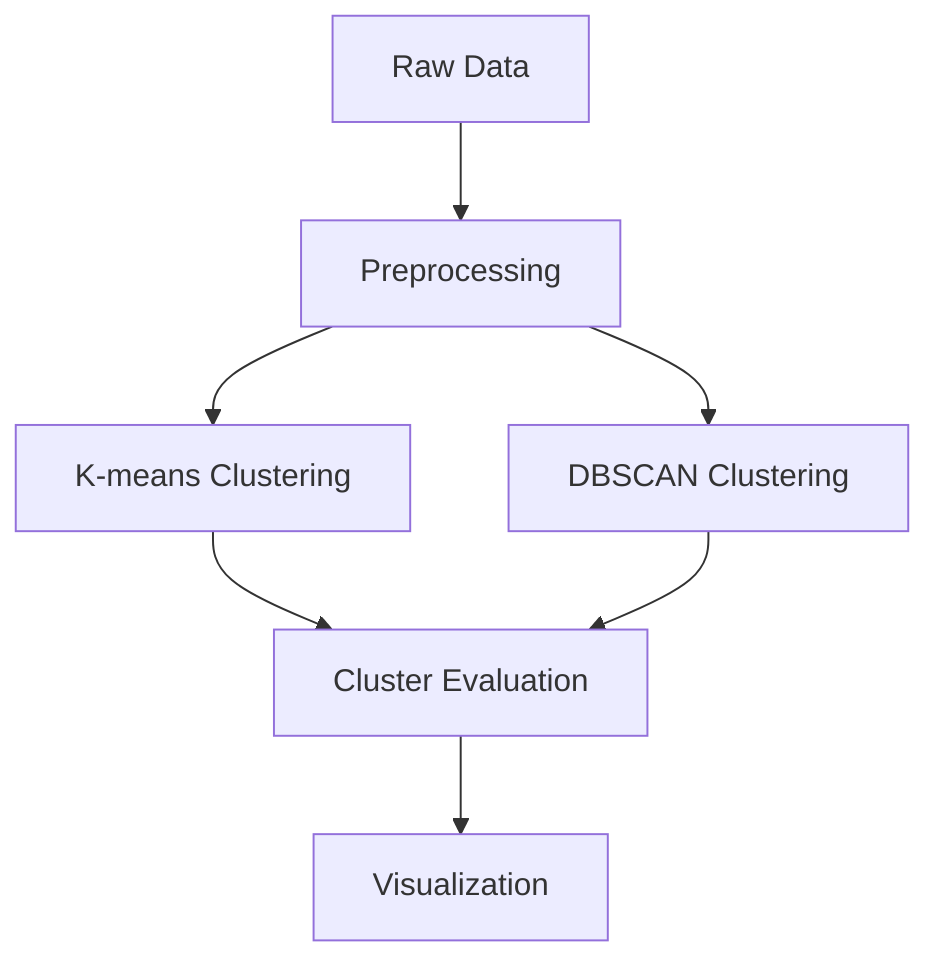

# Battery Composition Clustering Analysis


*Figure 1: DBSCAN clustering results showing battery composition groups*
https://github.com/AaronMartin78/Cluster-Analysis-Synthetic-Battery-Dataset/blob/main/Plots/dbscan_clusters.png?raw=true
## Table of Contents
- [Project Overview](#project-overview)
- [Key Features](#key-features)
- [Methodology](#methodology)
- [Key Findings](#key-findings)
- [How to Run](#how-to-run)
- [File Structure](#file-structure)
- [Data Availability](#data-availability)

## Project Overview
This project analyzes synthetic battery composition data using unsupervised machine learning to identify natural 
groupings of lithium-ion batteries based on their metal content (Li, Co, Ni, Mn) and recycling characteristics.

## Key Features
- **Synthetic Dataset Generation**: 2,500 batteries with:
  - 6 battery types (NMC, LFP, LCO, LMO variants)
  - Composition ranges, age, charge cycles, and recycling parameters
- **Cluster Analysis**:
  - K-means 
  - DBSCAN 
- **Visualization**:
  - PCA projections
  - Composition radar charts
  - k-Distance graphs for DBSCAN parameter tuning## Project Overview
 
## Methodology

1. **Data Generation**  
   Created synthetic dataset mimicking real battery chemistries:
   ```python
   battery_types = {
       'EV_NMC811': {'Li': [8,10], 'Co': [2,3], 'Ni': [14,17], ...},
       'EV_LFP': {'Li': [10,12], 'Co': [0,0.5], ...},
       ...
   }
   ```

2. **Clustering**  
   - Optimized K-means using silhouette scores and elbow method  
   - Tuned DBSCAN with k-distance graphs (eps=1.3, min_samples=12)

3. **Validation**  
   - Compared clusters against known battery types
   - Evaluated metrics:
     - Silhouette scores (~0.26 for both algorithms)
     - Noise percentage (0.3%)
     - Cluster size distribution

**Key Findings**:
- Clear separation of LFP (high Li) and LMO (high Mn) batteries
- NMC variants showed compositional overlap
- DBSCAN better handled intermediate compositions

## How to Run
1. Clone repository:
   ```bash
   git clone [https://github.com/yourusername/battery-clustering.git](https://github.com/AaronMartin78/Cluster-Analysis-Synthetic-Battery-Dataset)
   cd battery-clustering
   ```

2. Install requirements:
   ```bash
   pip install -r requirements.txt
   ```

3. Run analysis:
   ```bash
   jupyter notebook battery_clustering_analysis.ipynb
   ```
   
## File Structure
```
battery-clustering/
│
│   .gitignore
│   Cluster_Analysis_Final_Report.pdf
│   launch_jupyter.bat
│   LICENSE
│   README.md
│   requirements.txt
│
├───Data
│   ├───Full
│   │       battery_dataset_20250401_1513.csv
│   │       battery_dataset_20250401_1515.csv
│   │
│   └───Samples
│           battery_dataset_sample.csv
│
├───Notebooks
│   │   battery_cluster_FINAL.ipynb
│   │
│   └───Archive
│           battery clustering.ipynb
│           battery_cluster_analysis_2.ipynb
│
└───Plots
        cluster.png
        cluster_metals_boxplot.png
        dbscan_clusters.png
        elbow_and_silhouette.png
        k4_clusters.png
        kmeans_clusters_3_4_5.png
        metals_pairplot.png
        metals_scatter_with_reg.png
        metal_by_battery_type.png
        metal_composition_radar.png
        recovery_rate_kdensity.png
```
        
## Data Availability
The synthetic dataset used in this analysis is available in [`/data/Full/battery_dataset_20250401_1515.csv`](/data/Full/battery_dataset_20250401_1515.csv).

| File | Format | Description |
|------|--------|-------------|
| [battery_dataset_20250401_1515.csv](/data/Full/battery_dataset_20250401_1515.csv) | CSV | Primary dataset with 2,500 battery compositions |

## License
This project is licensed under the [MIT License](LICENSE) - see the [LICENSE](LICENSE) file for details.
